# 🦜️🔗 LangGraphGo

[](https://pkg.go.dev/github.com/paulnegz/langgraphgo)

> 🔀 **Forked from [tmc/langgraphgo](https://github.com/tmc/langgraphgo)** - Enhanced with streaming, visualization, observability, and production-ready features.

## 📦 Installation

```bash
go get github.com/paulnegz/langgraphgo
```

## 🚀 Features

- **LangChain Compatible** - Works with OpenAI, Anthropic, Google AI, and more
- **Graph Visualization** - Export as Mermaid, DOT, or ASCII diagrams  
- **Real-time Streaming** - Live progress updates with event listeners
- **State Checkpointing** - Pause and resume execution
- **Langfuse Integration** - Automatic observability and tracing for workflows
- **Production Ready** - Error handling, tracing, metrics, and backpressure

## 🎯 Quick Start

```go
// Simple LLM pipeline
g := graph.NewMessageGraph()
g.AddNode("generate", func(ctx context.Context, state interface{}) (interface{}, error) {
    messages := state.([]llms.MessageContent)
    response, _ := model.GenerateContent(ctx, messages)
    return append(messages, llms.TextParts("ai", response.Choices[0].Content)), nil
})
g.AddEdge("generate", graph.END)
g.SetEntryPoint("generate")

// Compile and run
runnable, _ := g.Compile()
result, _ := runnable.Invoke(ctx, initialState)
```

## 📚 Examples

- **[Basic LLM](./examples/basic_llm/)** - Simple LangChain integration
- **[RAG Pipeline](./examples/rag_pipeline/)** - Complete retrieval-augmented generation
- **[Streaming](./examples/streaming_pipeline/)** - Real-time progress updates
- **[Conditional Routing](./examples/conditional_routing/)** - Dynamic path selection
- **[Checkpointing](./examples/checkpointing/)** - Save and resume state
- **[Visualization](./examples/visualization/)** - Export graph diagrams
- **[Listeners](./examples/listeners/)** - Progress, metrics, and logging
- **[Subgraphs](./examples/subgraph/)** - Nested graph composition

## 🎨 Graph Visualization

```mermaid
%%{init: {'theme':'dark'}}%%
flowchart TD
    START(["🚀 START"])
    query[["🔍 Query Classifier"]]
    retrieve["📚 Retrieve Docs"]
    rerank["🎯 Rerank"]
    check{"✅ Relevance?"}
    generate["🤖 Generate"]
    fallback["🌐 Web Search"]
    format["📝 Format"]
    END(["✅ END"])
    
    START --> query --> retrieve --> rerank --> check
    check -->|>0.7| generate
    check -->|≤0.7| fallback --> generate
    generate --> format --> END
    
    style START fill:#90EE90,stroke:#fff,stroke-width:2px
    style END fill:#FFB6C1,stroke:#fff,stroke-width:2px
    linkStyle default stroke:#fff,stroke-width:2px
```



### Export Formats

```go
exporter := graph.NewGraphExporter(g)
mermaid := exporter.DrawMermaid()  // Mermaid diagram
dot := exporter.DrawDOT()          // Graphviz DOT  
ascii := exporter.DrawASCII()      // Terminal output
```

## 🔧 Key Concepts

### Conditional Routing
```go
g.AddConditionalEdge("router", func(ctx context.Context, state interface{}) string {
    if state.(Task).Priority == "high" {
        return "urgent_handler"
    }
    return "normal_handler"
})
```

### State Checkpointing
```go
g := graph.NewCheckpointableMessageGraph()
g.SetCheckpointConfig(graph.CheckpointConfig{
    Store: graph.NewMemoryCheckpointStore(),
    AutoSave: true,
})
```

### Event Listeners
```go
progress := graph.NewProgressListener().WithTiming(true)
metrics := graph.NewMetricsListener()
node.AddListener(progress)
node.AddListener(metrics)
```

### Langfuse Tracing
```go
// Set Langfuse credentials
os.Setenv("LANGFUSE_PUBLIC_KEY", "your-key")
os.Setenv("LANGFUSE_SECRET_KEY", "your-secret")

// Create tracer with Langfuse hook
tracer := graph.NewTracer()
// Add your tracing hooks here
// tracer.AddHook(yourHook)

// Create traced runnable for automatic observability
tracedRunnable := graph.NewTracedRunnable(runnable, tracer)
result, _ := tracedRunnable.Invoke(ctx, initialState)
```

## 📈 Performance

- **Graph Operations**: ~14-94μs depending on format
- **Tracing Overhead**: ~4μs per execution
- **Event Processing**: 1000+ events/second
- **Streaming Latency**: <100ms

## 🧪 Testing

```bash
go test ./graph -v              # Run tests
go test ./graph -bench=.        # Run benchmarks
```

## 📚 API Documentation

- [Core Graph](./graph/graph.go) - Basic graph operations
- [Streaming](./graph/streaming.go) - Real-time events
- [Listeners](./graph/listeners.go) - Event handlers
- [Checkpointing](./graph/checkpointing.go) - State persistence
- [Visualization](./graph/visualization.go) - Export formats
- [Tracing](./graph/tracing.go) - Execution tracing infrastructure

## 🤝 Contributing

This fork enhances [tmc/langgraphgo](https://github.com/tmc/langgraphgo) with production features while maintaining API compatibility.

## 📄 License

MIT License - see original repository for details.