# Graph Visualization Example

## Sample Graph Structure

The following diagram shows a typical LangGraphGo workflow:

```mermaid
flowchart TD
    START(["🚀 START"])
    style START fill:#90EE90,stroke:#333,stroke-width:2px
    
    input[["📥 Input Handler"]]
    style input fill:#87CEEB,stroke:#333,stroke-width:2px
    
    process["⚙️ Process Data"]
    style process fill:#FFE4B5,stroke:#333,stroke-width:2px
    
    validate{"✅ Validate"}
    style validate fill:#F0E68C,stroke:#333,stroke-width:2px
    
    transform["🔄 Transform"]
    style transform fill:#DDA0DD,stroke:#333,stroke-width:2px
    
    error["❌ Error Handler"]
    style error fill:#FFB6C1,stroke:#333,stroke-width:2px
    
    output["📤 Output"]
    style output fill:#98FB98,stroke:#333,stroke-width:2px
    
    END(["✅ END"])
    style END fill:#FFB6C1,stroke:#333,stroke-width:2px
    
    START --> input
    input --> process
    process --> validate
    validate -->|valid| transform
    validate -->|invalid| error
    transform --> output
    error --> END
    output --> END
```



## Code Example

```go
package main

import (
    "context"
    "fmt"
    "github.com/tmc/langgraphgo/graph"
)

func main() {
    // Create a new graph
    g := graph.NewMessageGraph()
    
    // Add nodes with business logic
    g.AddNode("input", func(ctx context.Context, state interface{}) (interface{}, error) {
        fmt.Println("📥 Processing input...")
        return state, nil
    })
    
    g.AddNode("process", func(ctx context.Context, state interface{}) (interface{}, error) {
        fmt.Println("⚙️ Processing data...")
        return state, nil
    })
    
    g.AddNode("validate", func(ctx context.Context, state interface{}) (interface{}, error) {
        fmt.Println("✅ Validating...")
        return state, nil
    })
    
    // Add conditional routing
    g.AddConditionalEdge("validate", func(ctx context.Context, state interface{}) string {
        // Validation logic here
        if valid := true; valid {
            return "transform"
        }
        return "error"
    })
    
    // Set up graph flow
    g.SetEntryPoint("input")
    g.AddEdge("input", "process")
    g.AddEdge("process", "validate")
    g.AddEdge("transform", "output")
    g.AddEdge("output", graph.END)
    
    // Compile and run
    runnable, _ := g.Compile()
    result, _ := runnable.Invoke(context.Background(), "Hello World")
    fmt.Printf("Result: %v\n", result)
}
```

## Features Demonstrated

- **Node Creation**: Define processing steps
- **Conditional Edges**: Dynamic routing based on state
- **Error Handling**: Separate error paths
- **Graph Compilation**: Convert to executable runnable
- **State Management**: Pass data through the workflow